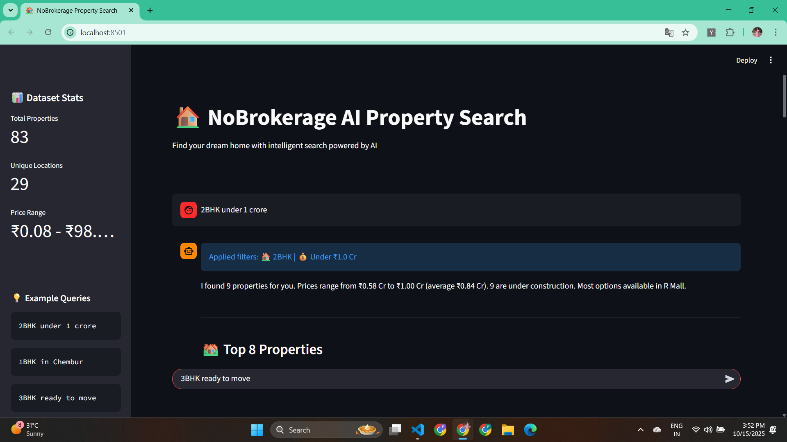

# NoBrokerage Property Search Chatbot

[](https://opensource.org/licenses/MIT)

AI-powered property search chatbot that understands natural language queries and returns relevant property recommendations.



## Features
- Natural language search ("3BHK flat in Pune under ₹1.2 Cr")
- Smart filter extraction (BHK, budget, location, status)
- AI-generated summaries from real data
- Property cards with full address
- Works with local CSV files (no external APIs)

## Setup
```bash
1. Clone and install
git clone https://github.com/pooja30123/Nobrokerage-Chatbot.git
cd Nobrokerage-Chatbot
pip install -r requirements.txt

2. Set up API key
echo "GEMINI_API_KEY=your_key_here" > .env

3. Run the app
streamlit run app.py
```

## Usage Examples
```
"2BHK under 1 crore"
"1BHK in Chembur"
"3BHK ready to move"
"Flat near Lodha Xperia Mall"
```

## Architecture
```
User Query → Query Parser → Filter Extraction → Data Search → AI Summary → Response
```

## Dependencies
- Streamlit (frontend)
- Pandas (data processing)
- Google Gemini (AI summarization)
- Python-dotenv (configuration)

Live Demo: [https://pooja30123-nobrokerage-chatbot-streamlit-app-uxn5rs.streamlit.app/](https://pooja30123-nobrokerage-chatbot-streamlit-app-uxn5rs.streamlit.app/)

Deployed on Streamlit Community Cloud with zero configuration.
